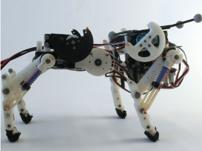

# Flexible Spine Quadruped Simulation


## Overview
This repository contains a simulation for a flexible spine quadruped robot, designed to model and analyze the dynamics of legged locomotion. The simulation incorporates both rigid and flexible spine models to investigate the effects of body compliance on gait efficiency, stability, and energy consumption.



## General Principle
Simulating a walking quadruped robot involves several critical steps:

1. **Construct the Body and Legs:** Define the robot's physical structure, including the torso and limbs. Understand the frame transformations to derive forward and inverse kinematics for precise foot placement.
2. **Model Contact Forces:** Develop a reliable ground contact force model. This is challenging due to the complexity of real-world interactions and the potential for computational stiffness in simulations.
3. **Design a Gait Planner:** Implement a mechanism to move the robot's feet in a periodic, stable manner.

## Helper Code
- `forward_kinematics.m`: Calculates forward kinematics for each leg (a three-joint manipulator).
- `inverse_kinematics.m`: Computes inverse kinematics.
- `init_flexible_spine_quadruped.m`: Initializes simulation parameters.

## Components
- **`flexible_spine_quadruped.slx`**: Simulink model for the quadruped simulation.

## Abstract
The development of a Simscape model for a flexible spine quadruped progresses through staged construction and refinement. This simulation provides insights into realistic motion, gait dynamics, and the role of body flexibility in quadrupedal locomotion. 

## Model Overview

### Rigid Body Model
- Represents the torso as a single, non-flexible segment.
- Baseline for performance evaluation.


### Flexible Body Model
- Includes a torso divided into two segments, connected by a torsional spring-damper joint.
- Simulates rotational compliance for energy absorption and adaptive motion.


## Simulation Setup

### Phases of Gait
- **Double-leg Flight (DF):** All legs off the ground.
- **Fore-leg Stance (FS):** Forelegs in contact with the ground.
- **Hind-leg Stance (HS):** Hind legs in contact with the ground.
- **Double-leg Stance (DS):** Both fore and hind legs in contact.


## Modeling

A variety of gaits exist for a four-legged robot. In these gaits, at each time step, one, two, three, or four legs may be on the ground. This study models the system dynamics, considering flight mode and constrained dynamics. The modeling process follows these steps:

1. Deriving the Lagrangian and extracting equations of motion.
2. Adding constraints based on the number of legs in contact with the ground.
3. Modeling ground contact dynamics.

Validation of the derived equations was performed using MATLAB’s SimMechanics toolbox, confirming their accuracy.


---

### Unconstrained Dynamics

#### Generalized Coordinates

The generalized coordinates fully specify the robot’s position during flight mode:

```math
q_s = [q_1, q_2, \dots, q_8, q_9, q_{10}]^T
```

```math
q = [q_s; q_{11}; q_{12}]
```

Here, (q_i, i=1,...,10) are relative joint angles, while (q_11, q_12) represent the horizontal and vertical positions of the first leg’s tip.

#### Lagrangian Formulation

The Lagrangian is derived as:

```math
L = T - U
```

Where:
- Kinetic energy:

```math
T = \sum_{i=1}^{10} \left( \frac{1}{2} m_i V_{cm_i}^2 + \frac{1}{2} I_i \omega_i^2 \right)
```

- Potential energy:

```math
U = \sum_{i=1}^{10} m_i g Y_{cm_i}
```

The equations of motion follow:

```math
\frac{d}{dt} \frac{\partial L}{\partial \dot{q}_i} - \frac{\partial L}{\partial q_i} = \tau_i
```

#### Constraint Modeling

Adding constraints for grounded legs modifies the equations of motion. For instance, if the first leg is on the ground:

```math
J_1 \dot{q} = 0, \quad J_1 = \begin{bmatrix} 0 & 0 & \dots & 1 & 0 \\
0 & 0 & \dots & 0 & 1 \end{bmatrix}_{2 \times 12}
```

For N legs on the ground, the augmented Jacobian matrix is:

```math
J = \begin{bmatrix} J_1^T \\ \vdots \\ J_N^T \end{bmatrix}_{2N \times 12}
```

The constrained system is described by:

```math
D(q) \ddot{q} + C(q, \dot{q}) \dot{q} + G(q) = \tau + J^T F
```

---

### Contact Dynamics

Ground contact introduces impulse forces, leading to discrete velocity changes. The relationship is given by:

```math
D(q) \dot{q}^+ - D(q) \dot{q}^- = J^T F_{\text{integrated}}
```

The updated velocities are:

```math
\dot{q}^+ = D(q)^{-1} \left( J^T F_{\text{integrated}} \right) + \dot{q}^-
```

---

## Nonlinear Constrained Control

### Tracking Control

Tracking error is defined as:

```math
e = B^T q - q_b(t)
```

The desired error dynamics are:

```math
\ddot{e} + K_d \dot{e} + K_p e = 0
```

Substituting into the system dynamics yields the required torque for trajectory tracking:

```math
\begin{bmatrix}
D(q) & J^T & 0 \\
J & 0 & B^T \\
0 & B & B^T D(q)^{-1} B
\end{bmatrix}
\begin{bmatrix}
\ddot{q} \\
F \\
\tau
\end{bmatrix} =
\begin{bmatrix}
-C(q, \dot{q}) \dot{q} - G(q) \\
-\dot{J} \dot{q} \\
-K_p e - K_d \dot{e} + \ddot{q}_b + B^T D(q)^{-1} \left( C(q, \dot{q}) \dot{q} + G(q) \right)
\end{bmatrix}
```

This formulation ensures asymptotic convergence of the tracking error to zero.

## Files
- `forward_kinematics.m`: Forward kinematics calculations.
- `inverse_kinematics.m`: Inverse kinematics calculations.
- `init_flexible_spine_quadruped.m`: Parameter initialization.
- `flexible_spine_quadruped.slx`: Simulink model.


## How to Run
1. Clone the repository.
2. Initialize parameters using `init_flexible_spine_quadruped.m`.
3. Open and run `flexible_spine_quadruped.slx` in Simulink.
4. Analyze the simulation results to study the dynamics of rigid and flexible body models.

## Future Work
- Incorporate advanced contact models for more accurate simulations.
- Optimize gait planning for energy efficiency.
- Extend to uneven terrain simulation.

## References
This work builds upon established biomechanical and robotic research on quadruped locomotion, emphasizing the role of body flexibility in improving gait stability and efficiency.

---
## Conclusion

This framework combines modeling and control techniques to enable precise trajectory tracking and stable locomotion for quadruped robots. Further exploration may involve optimizing computational efficiency and extending the approach to different gaits and terrains.

---
